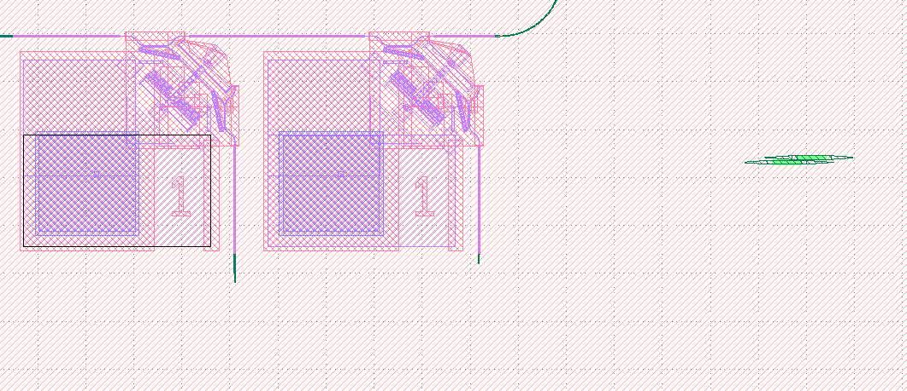

Autorouting
-----------

.. currentmodule:: pyphotonics.layout.routing

Pyphotonics makes it easy to connect ports of devices in a GDS files by automatically generating waveguides. For example, suppose we have the following layout, where we would like to connect the two MEMS switches to the corresponding grating couplers with waveguides.

Since the connecting waveguides are fairly simple in this case, we can use :meth:`pyphotonics.layout.routing.direct_route`. We first find the GDS coordinates of the midpoint of each of port in question, as well as their directions relative to the positive x axis. In this case, we are using 800 nm waveguides with minimum bend radius 20 um and an option to use a bend radius of 50 um.

.. code-block:: python

  from pyphotonics.layout.routing import direct_route, write_paths_to_gds

  waveguide_1 = direct_route(
      (-4190.777, -3689.900, -90), (-3913.913, -3584.208, 0), 0.8, [20, 50]
  )
  waveguide_2 = direct_route(
      (-4445.577, -3709.900, -90), (-3801.707, -3579.208, 180), 0.8, [20, 50]
  )
  write_paths_to_gds([waveguide_1, waveguide_2], "/Users/rohan/Downloads/test.gds")

.. warning::

  :meth:`direct_route` does not account for waveguide crossings and simply connects two ports in the most efficient way possible. Crossings can be avoided by offsetting ports slightly from one another, as shown in the image above.
