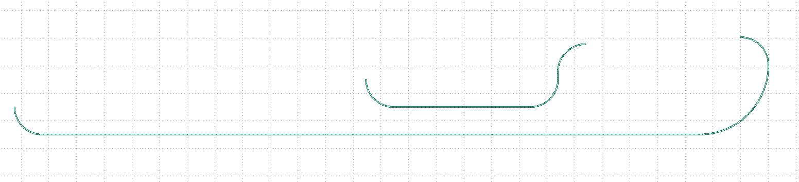
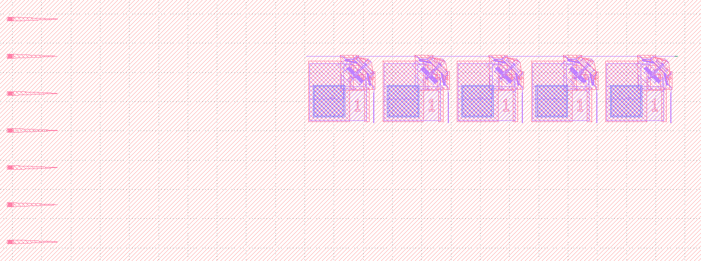
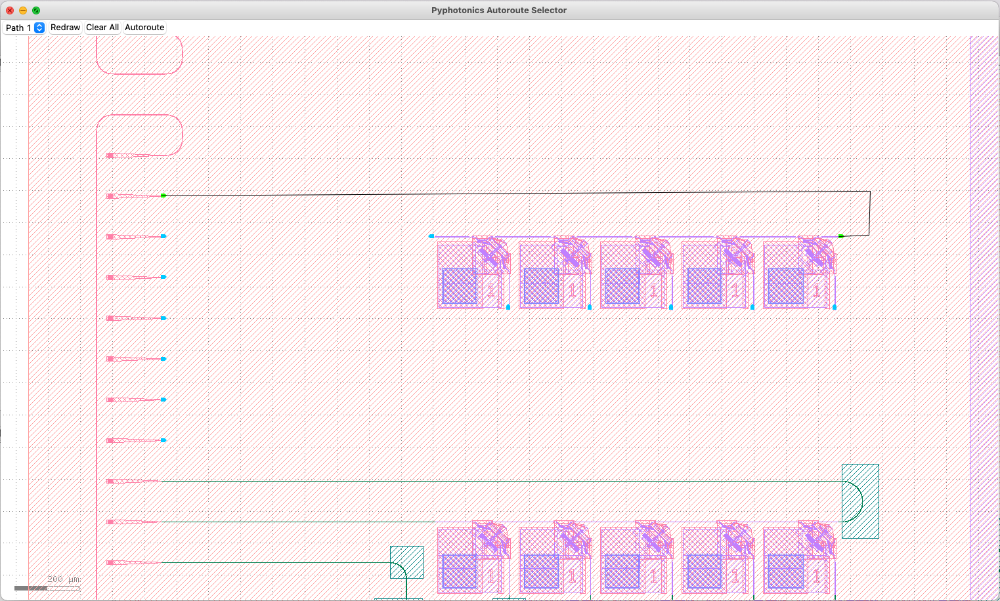
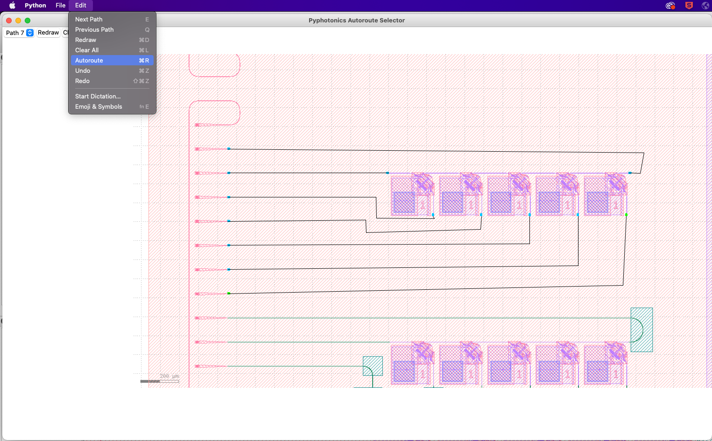
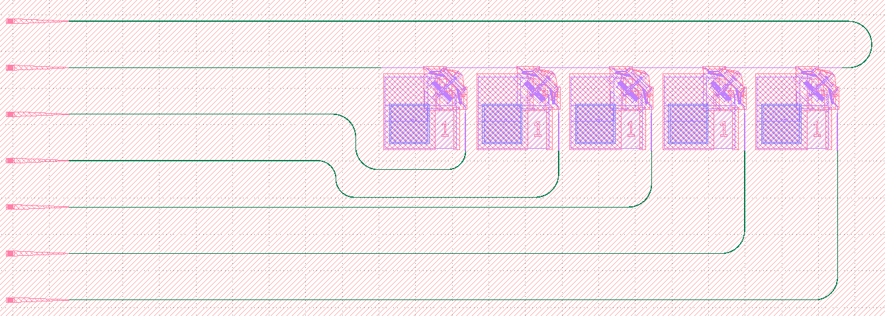
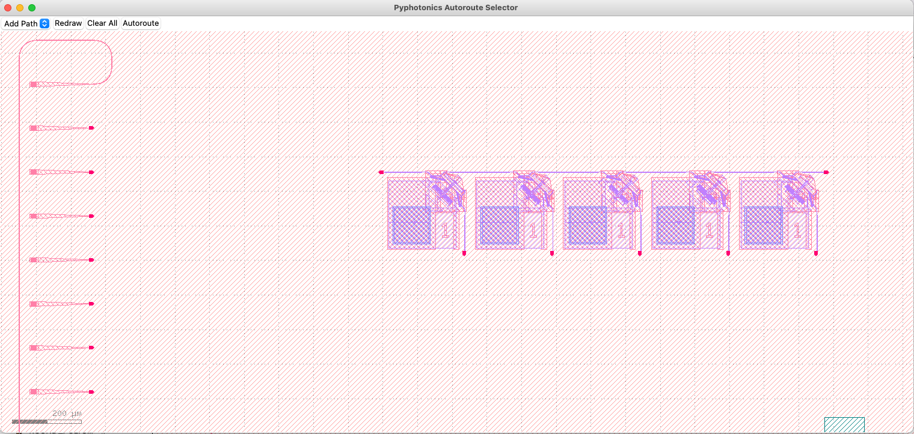
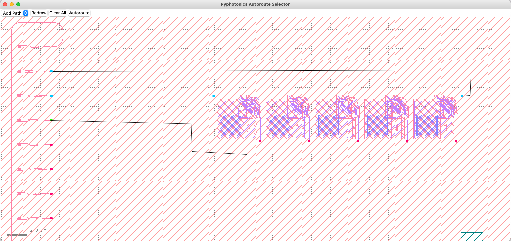
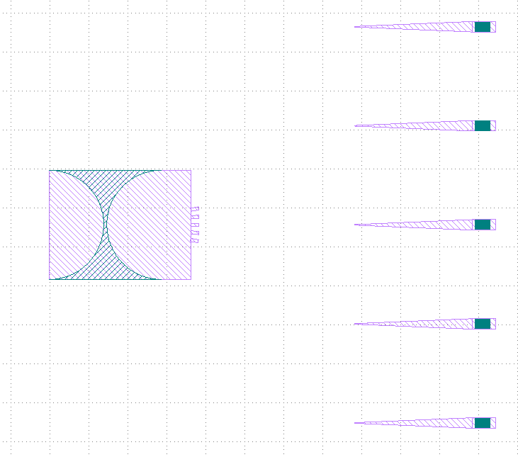
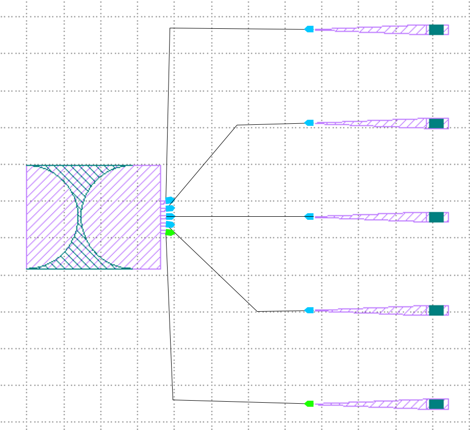
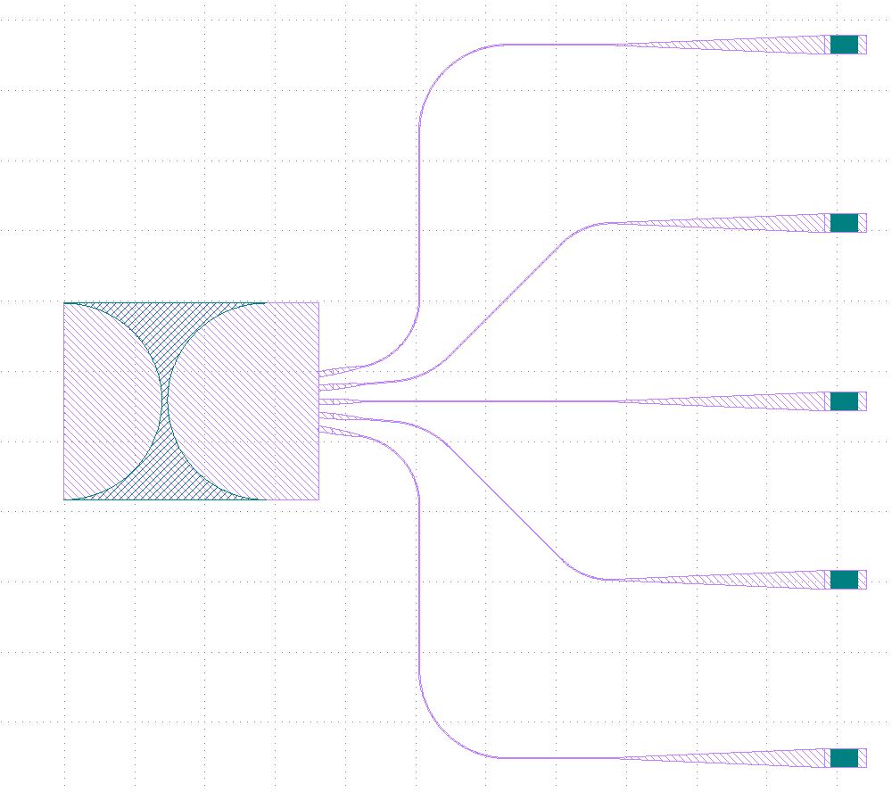

Autorouting
-----------

.. currentmodule:: pyphotonics.layout.routing

Pyphotonics makes it easy to connect ports of devices in a GDS files by automatically generating waveguides. For example, suppose we have the following layout, where we would like to connect the two MEMS switches to the corresponding grating couplers with waveguides.

.. image:: _static/switch_coupler.png

Direct Routing
~~~~~~~~~~~~~~

Since the connecting waveguides are fairly simple in this case, we can use :meth:`pyphotonics.layout.routing.direct_route`. We first find the GDS coordinates of the midpoint of each of port in question, as well as their directions relative to the positive x axis. In this case, we are using 800 nm waveguides with minimum bend radius 20 um and an option to use a bend radius of 50 um.

.. code-block:

  import numpy as np
  from pyphotonics.layout.routing import Router, direct_route, Port, WaveguideGeometry

  router = Router()

  waveguide_1 = router.direct_route(
      Port(-4190.777, -3689.900, -np.pi/2), Port(-4032.002, -3664.303, 0), WaveguideGeometry(0.8), [20, 50]
  )
  waveguide_2 = router.direct_route(
      Port(-4444.777, -3709.900, -np.pi/2), Port(-3919.955, -3659.303, np.pi), WaveguideGeometry(0.8), [20, 50]
  )
  router.write_paths_to_gds([waveguide_1, waveguide_2], "/Users/rohan/Downloads/direct_route.gds", layer=1111)

The exported GDS with autogenerated waveguides is shown below.

We can then copy the generated waveguides to our device GDS to complete the layout.

.. image:: _static/direct_route_copied.png

.. warning::

  :meth:`direct_route` does not account for waveguide crossings or obstacles and simply connects two ports in the most efficient way possible. Crossings can be avoided by offsetting ports slightly from one another, as demonstrated above. It may also not work for cases where the ports cannot be connected by a simple two segment path.

If you would like to override the direction chosen by :meth:`direct_route`, you can use the ``x_first`` argument. In the example above, we may want to avoid the 180 degree bend in the upper waveguide, so we can specify ``x_first=False``:

.. code-block::

  waveguide_1 = router.direct_route(
      Port(-4190.777, -3689.900, -90), Port(-4032.002, -3664.303, 0), WaveguideGeometry(0.8), [20, 50], x_first=False
  )

.. image:: _static/direct_route_xfirst.png

More complex paths can be created by chaining together several :meth:`direct_route` function calls, although this is fairly impractical and tedious because it requires careful planning of path coordinates. Thus, Pyphotonics provides :meth:`user_route` to quickly create more complex paths through an easy-to-use UI.

User Routing
~~~~~~~~~~~~

The general idea of user routing is that a layout designer likely knows the general waveguide geometry they want, but manually creating the correctly dimensioned polygons and bends is slow and tedious. The :meth:`user_route` function allows users to specify the general geometry they want through the function call and a GUI created upon calling it, then creates Manhattan waveguides with the correct specifications.

Suppose we want to route this much more complex layout consisting of 7 grating couplers and 5 MEMS swiches, which is saved at the path :file:`/Users/rohan/Downloads/test.gds`. 

Once we find the coordinates of the relevant ports, we can write the following code:

.. code-block::

  import numpy as np
  from pyphotonics.layout.routing import Router, Port, WaveguideGeometry

  router = Router()

  inputs = [Port(-11545.453, 2182.5 - 127 * i, 0) for i in range(7)]
  outputs = [
      Port(-9435.453, 2055.5, np.pi),
      Port(-10695.453, 2055.5, 0)
  ] + [Port(-10463.728 + 254*i, 1826.777, np.pi/2) for i in range(5)]

  waveguides = router.user_route(
      WaveguideGeometry(0.8), [50, 62.75], inputs=inputs, outputs=outputs, current_gds="/Users/rohan/Downloads/test.gds"
  )

  router.write_paths_to_gds(waveguides, "/Users/rohan/Downloads/user_route.gds", layer=1111)

When we run this code snippet, Pyphotonics will automatically calculate an appropriate bounding box from the given inputs and ports, take a screenshot of the layout around the provided ports, and open a GUI for the user to specify waveguide routes.

The port that is currently being drawn is highlighted in green, and the path to be placed is shown between the cursor and the last placed point. Points along the route can be placed using the left mouse button. If a placed point causes the route to intersect the output port marker, the route will snap to the port and the selected path is complete. If a path was incorrectly drawn, it can be cleared and redrawn using ``Ctrl+D`` or :menuselection:`Edit --> Redraw`.

Once a path is completed, the next path can be selected using the ``E`` key or by selecting the appropriate path in the top left corner of the GUI. The previous path can be selected using the ``Q`` key. The GUI also supports undoing and redoing actions, zooming and panning with the middle mouse button, and saving routes for future use.

Once we have finished specifying all routes, we can use ``Ctrl+R`` or :menuselection:`Edit --> Autoroute` to export the waveguides as a GDS file. 

.. note::

  If you would like to use the same routes in multiple runs of the script, make sure to save your routes before autorouting. The path to the created :file:`.route` file can be specified in the optional ``route_file`` parameter of :meth:`user_route` to provide user inputted paths without reopening the GUI.

Pyphotonics will automatically straighten out waveguides and ensure the correct bend radii for each path. Although ports of any angle are supported, connecting paths are only created parallel or at a 45 degree angle to the x and y axes. The exported waveguides can then be copied into the final GDS to complete the layout.

Automatic Port Finding
^^^^^^^^^^^^^^^^^^^^^^

Pyphotonics also automatically finds potential ports during user routing, and allows users to add additional paths beyond the ones specified in their call to :meth:`user_route` from the GUI. If we want to exclusively create paths through the GUI to avoid having to manually find coordinates from the GDS, we can use the ``bbox`` parameter to tell :meth:`user_route` where to look for ports by specifying the bottom-left and upper-right corners of the area.

In our example from above, we can make the following call to :meth:`user_route` to make use of this feature.

.. code-block::

   waveguides = router.user_route(
       WaveguideGeometry(0.8), [50, 62.75], bbox=(-11804, 1302, -9167, 2464), current_gds="/Users/rohan/Downloads/test.gds"
   )

We then get the following screen, with potential ports highlighted in red.

We can then click on the desired port to begin a path, click to place points along the path, and then click on another port to complete the path. Once the path is completed, it will be added to the list of paths and can be redrawn between the same two ports as necessary. Additional paths can be added by selecting "Add Path" in the path selection dropdown, hitting ``Shift+A``, or selecting :menuselection:`Edit --> Add Path`. Once the desired paths are added, we can the steps outlined earlier to finish autorouting.

Additional Port Geometries and Tapers
^^^^^^^^^^^^^^^^^^^^^^^^^^^^^^^^^^^^^

Sometimes, waveguides must connect ports with different geometries. If these port geometries are specified, Pyphotonics can automatically detect these additional ports and create the necessary tapers to connect them to the desired waveguide routes.

Specifically, Pyphotonics creates adiabatic tapers according to the process outlined by `Fu et al. <https://opg.optica.org/prj/abstract.cfm?uri=prj-2-3-a41>`_ to convert any given port geometry into that of the connecting waveguide.

For example, suppose we wanted to route the input waveguides of this planar lens to a fiber grating array, as shown below.

The input waveguides are 4 um wide slabs, while the fiber inputs and connecting waveguides are 800 nm wide slabs. We can utilize Pyphotonics to automatically taper down the input waveguides of the lens and connect them to the fiber gratings with the following code:

.. code-block::

  from pyphotonics.layout.routing import Router, Port, WaveguideGeometry

  router = Router(wavelength=1.55)

  waveguides = router.user_route(
      WaveguideGeometry(0.8),
      [50, 62.5],
      bbox=(-4900, 20, -2741, 2500),
      current_gds="/Users/rohan/Downloads/lenses.GDS",
      port_geometries=[WaveguideGeometry(4)],
  )

  router.write_paths_to_gds(waveguides, "/Users/rohan/photonics/presentation/lenses_routes.gds", layer=2)

By specifying the optional ``port_geometries`` argument in :meth:`user_route`, we can automatically detect the 4 um wide input ports to the lens, and route them as normal with the GUI.

Running the autorouting script and copying over the generated routes, we get the result below.

